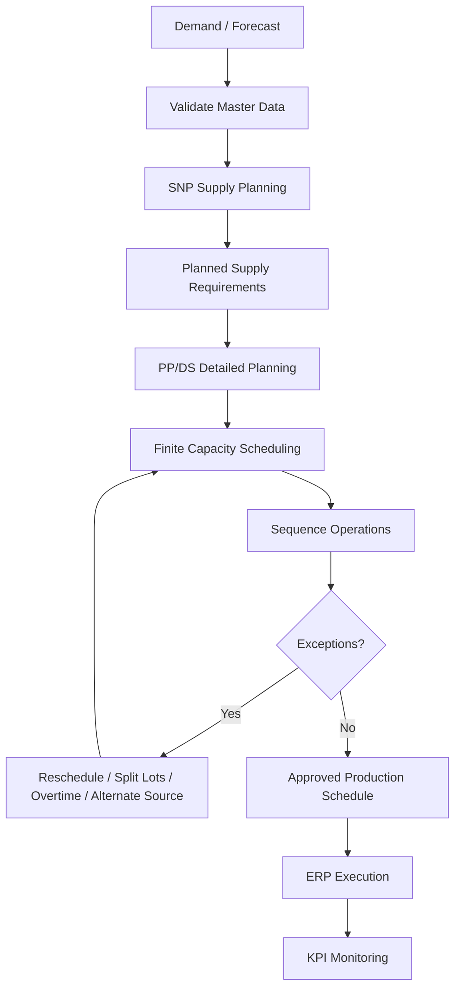

# SAP SCM Production Planning & Scheduling Integration

## Week 3 Internship Project

This repository documents a **Production Planning and Scheduling Integration project using SAP SCM / SAP APO concepts**, with emphasis on **Supply Network Planning (SNP)** and **Production Planning and Detailed Scheduling (PP/DS)**.

The scenario continues the fictional **Deccan Harvest Foods Pvt. Ltd.** case from the earlier weeks and focuses on converting demand requirements into a feasible production schedule while considering material availability, routing, shared resources, capacity constraints and synchronization with SAP ERP.

> **Project type:** Internship planning simulation and SAP configuration blueprint. It is not presented as a live productive-system implementation.

## Final Report

📄 [**Open the Week 3 Final Reviewed Word Report**](docs/SAP_SCM_Week3_Production_Planning_Scheduling_Hrudhai_Final_Reviewed.docx)

## Project Objective

The project aims to demonstrate how SAP SCM planning concepts can support:

- demand-to-production planning
- master-data validation
- BOM, routing and production-version alignment
- resource and finite-capacity scheduling
- planned-order sequencing
- bottleneck identification
- ERP ↔ SAP SCM/APO synchronization through CIF concepts
- scenario-based rescheduling
- KPI monitoring and risk mitigation

## Scenario

The fictional manufacturing plant produces three millet-based products using shared processing and packaging resources. Peak-week production is intentionally planned close to available packaging capacity so that the project can evaluate a realistic bottleneck.

The illustrative capacity example uses approximately **138.5 tonnes of planned production against 145 tonnes of weekly packaging capacity**, giving about **95.5% utilization**.

## Planning Methodology

1. Review demand / forecast requirements.
2. Validate planning master data.
3. Create the medium-term supply plan using SNP concepts.
4. Transfer feasible production requirements into detailed planning.
5. Review planned orders in PP/DS.
6. Schedule operations against finite resource capacity.
7. Sequence products to reduce changeovers.
8. Identify overloads, shortages and timing exceptions.
9. Apply corrective actions such as resequencing, lot splitting, overtime or alternate sourcing.
10. Synchronize execution-relevant planning information with ERP through CIF concepts.
11. Monitor schedule adherence, OTIF, utilization and shortages.

See [`docs/production-planning-methodology.md`](docs/production-planning-methodology.md).

## SAP SCM / APO Concepts Applied

| Area | Concepts used |
|---|---|
| Demand & Supply Planning | Forecast requirements, SNP supply planning |
| Production Master Data | Material/product, BOM, routing, work center/resource |
| Production Integration | Production versions and PDS concepts |
| Scheduling | PP/DS, finite capacity, sequencing and rescheduling |
| Capacity | Resource calendars, utilization and bottleneck analysis |
| ERP Integration | CIF integration and synchronization concepts |
| Exception Handling | Material shortage, breakdown and demand-spike response |
| Monitoring | Schedule adherence, OTIF, capacity utilization and changeovers |

## Demand to Schedule Flow



## ERP ↔ SAP SCM/APO Integration

The project uses **CIF integration concepts** to explain how planning-relevant data can be synchronized between SAP ERP and SAP SCM/APO.

Typical ERP-to-APO information includes materials/products, BOMs, routings, work centers, production versions, resources, stocks and relevant transactional data. APO then supports network planning and detailed production scheduling, while approved planning results can be synchronized back toward ERP execution.

See [`docs/integration-notes.md`](docs/integration-notes.md).

## Bottleneck Analysis

The packaging line is treated as the key shared constraint. The project evaluates how high utilization can amplify the effect of:

- equipment breakdown
- long changeovers
- packaging-material delays
- unexpected demand increases
- frequent urgent rescheduling

Mitigation options include resequencing, lot splitting, overtime, alternate sourcing, expediting and priority-based scheduling.

See [`docs/bottleneck-analysis.md`](docs/bottleneck-analysis.md).

## Scenario Analysis

### Equipment breakdown
Resequence unaffected operations, protect high-priority demand, evaluate overtime and use available buffer capacity.

### Packaging-material delay
Expedite or use alternate sourcing where feasible, then resequence production based on material availability.

### Demand spike
Recheck capacity, prioritize confirmed demand, split or shift lots where practical and communicate delivery impact when capacity cannot absorb the increase.

## Key KPIs

- schedule adherence
- OTIF / service performance
- capacity utilization
- changeover hours
- production lead time
- material-shortage frequency
- forecast variance
- planned-order delay
- integration / synchronization errors

## Repository Structure

```text
SAP-SCM-Production-Planning-Scheduling-Integration/
|
|-- README.md
|-- docs/
|   |-- SAP_SCM_Week3_Production_Planning_Scheduling_Hrudhai_Final_Reviewed.docx
|   |-- production-planning-methodology.md
|   |-- integration-notes.md
|   `-- bottleneck-analysis.md
|
`-- diagrams/
    |-- demand-to-schedule-flow.md
    |-- erp-scm-integration.md
    `-- bottleneck-response.md
```

## Supporting Diagrams

- [`Demand to Schedule Flow`](diagrams/demand-to-schedule-flow.md)
- [`ERP and SAP SCM/APO Integration`](diagrams/erp-scm-integration.md)
- [`Bottleneck Response Flow`](diagrams/bottleneck-response.md)

## Learning Outcomes

This project helped strengthen my understanding of the difference between medium-term supply planning and short-term detailed scheduling. It also showed how master-data quality, resource capacity, sequence decisions and system integration can directly affect whether a production plan is actually executable.

The exercise also improved my understanding of how production planners respond to overloads, material shortages, breakdowns and demand changes rather than relying only on an unconstrained plan.

## Author

**Hrudhai Prem Kumar Patwari**  
SAP SCM / SAP MM Learner | IT Operations Professional

---

### Academic / Internship Use

This repository is a learning and internship project. Company names, quantities, capacities, demand values and scenario results are fictional and are used only to demonstrate SAP SCM production-planning and scheduling concepts.
