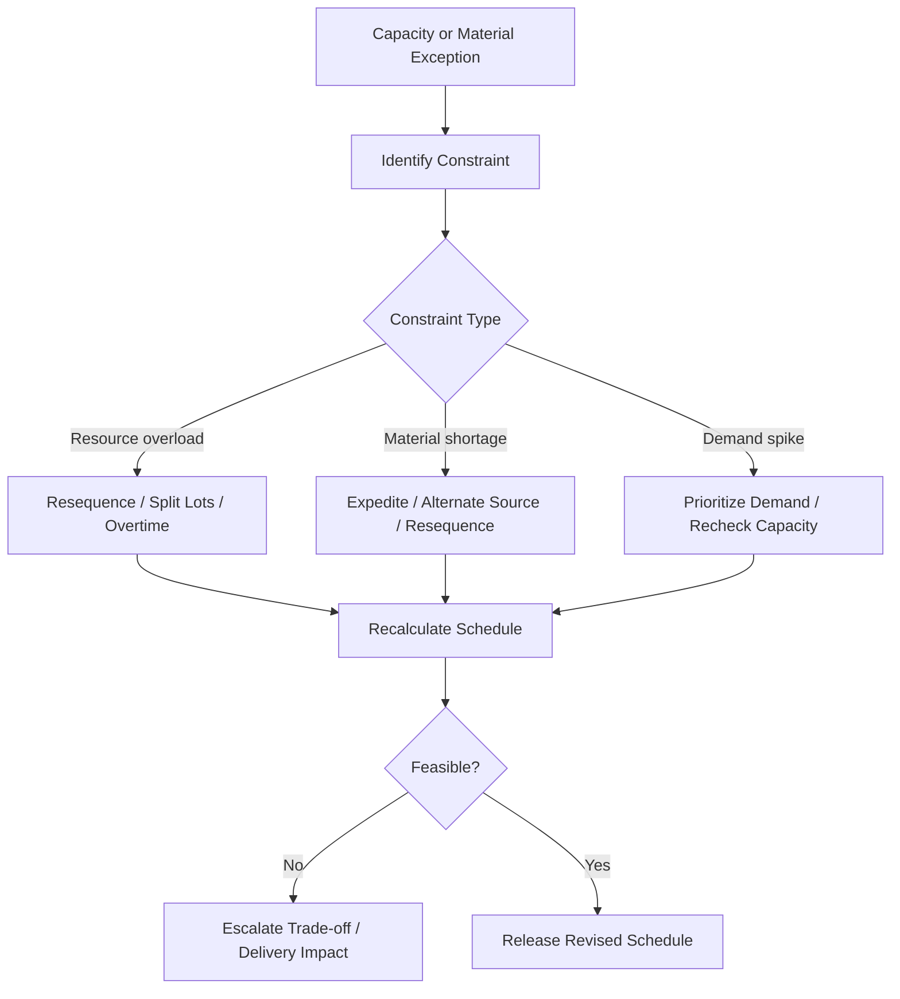

# Bottleneck Response Flow

```mermaid
flowchart TD
    A[Capacity or Material Exception] --> B[Identify Constraint]
    B --> C{Constraint Type}
    C -->|Resource overload| D[Resequence / Split Lots / Overtime]
    C -->|Material shortage| E[Expedite / Alternate Source / Resequence]
    C -->|Demand spike| F[Prioritize Demand / Recheck Capacity]
    D --> G[Recalculate Schedule]
    E --> G
    F --> G
    G --> H{Feasible?}
    H -- No --> I[Escalate Trade-off / Delivery Impact]
    H -- Yes --> J[Release Revised Schedule]
```

This flow represents the practical response logic used in the Week 3 scenario analysis.
