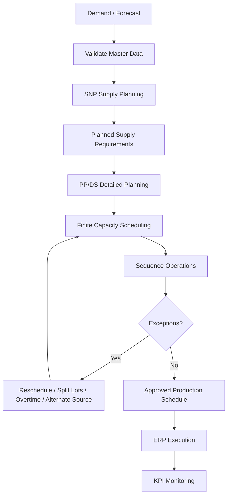

# Demand to Production Schedule Flow

```mermaid
flowchart TD
    A[Demand / Forecast] --> B[Validate Master Data]
    B --> C[SNP Supply Planning]
    C --> D[Planned Supply Requirements]
    D --> E[PP/DS Detailed Planning]
    E --> F[Finite Capacity Scheduling]
    F --> G[Sequence Operations]
    G --> H{Exceptions?}
    H -- Yes --> I[Reschedule / Split Lots / Overtime / Alternate Source]
    I --> F
    H -- No --> J[Approved Production Schedule]
    J --> K[ERP Execution]
    K --> L[KPI Monitoring]
```

This diagram summarizes the Week 3 methodology from demand requirements to a feasible production schedule.
