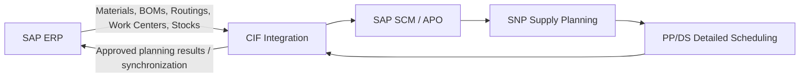

# ERP and SAP SCM/APO Integration Flow

The diagram shows the conceptual information flow used in the Week 3 project. CIF is treated as the synchronization layer between ERP execution data and APO planning objects.
